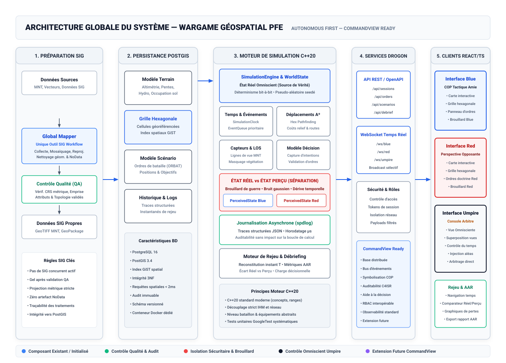
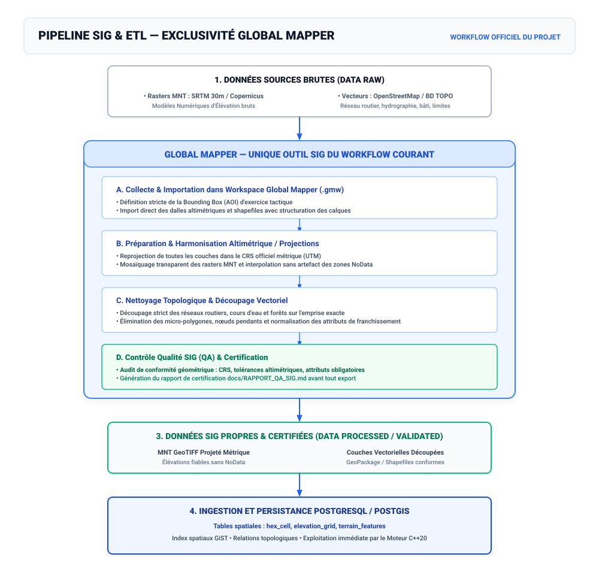
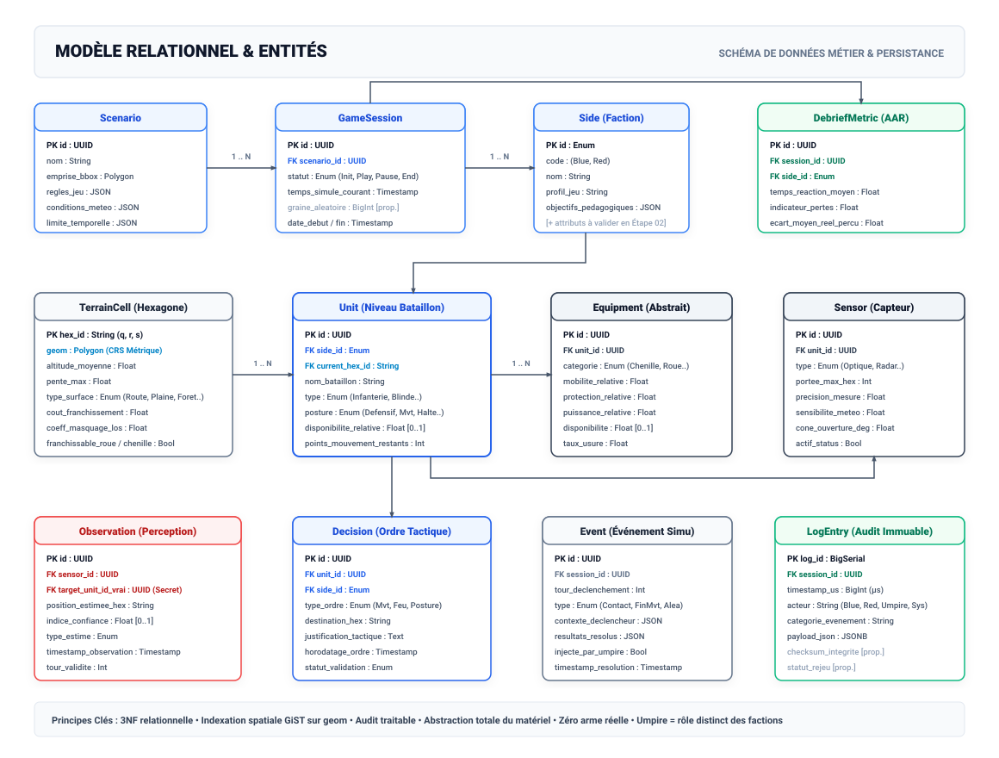
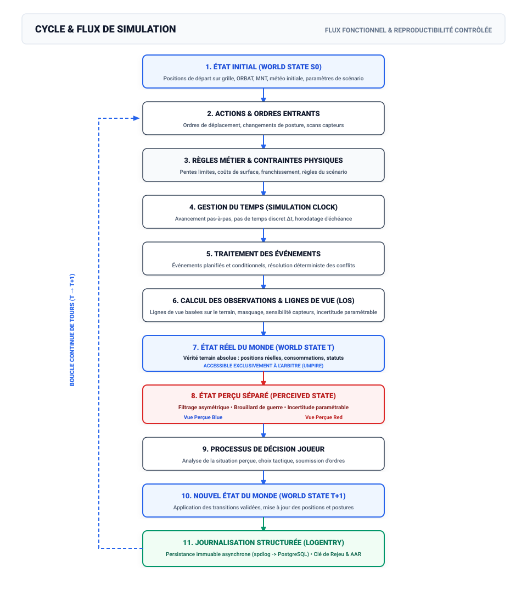
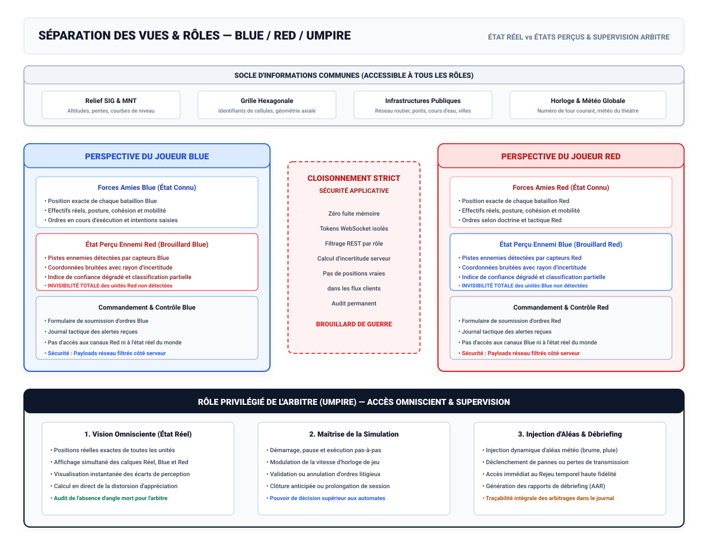
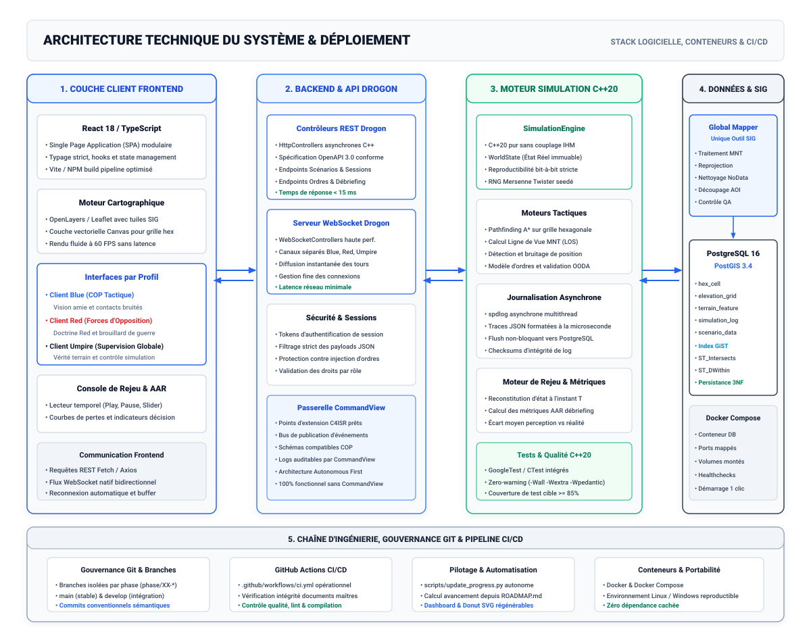

# ARCHITECTURE DU PROJET

Référence : `MASTER_PROMPT.md` (Version 1.0 — PFE 2026–2027) & `Cahier_des_charges_PFE_Wargame_geospatial.docx`.  
Principe directeur : « Autonomous First — CommandView Ready » (système 100% autonome pour le PFE, tout en préparant des interfaces ouvertes compatibles avec une intégration ultérieure dans le C4ISR CommandView).  
Diagrammes : Tous les schémas sont présentés sous forme vectorielle haute fidélité avec fond blanc (sources modifiables dans [`docs/assets/architecture/source/`](assets/architecture/source/)).

---

## Vue globale

### Explication de l'architecture globale

L'architecture du wargame géospatial repose sur un découpage en cinq couches horizontales étanches, garantissant l'indépendance de la simulation vis-à-vis de l'affichage et du réseau :

1. **Préparation SIG amont** : Traitement des données géographiques exclusivement sous Global Mapper, garantissant l'intégrité du Modèle Numérique de Terrain (MNT), du réseau viaire et de l'occupation du sol. Les couches certifiées par le contrôle qualité (QA) sont exportées sans valeurs NoData vers les formats d'ingestion standardisés (GeoTIFF projeté métrique, GeoPackage).
2. **Persistance spatiale PostgreSQL / PostGIS** : Source de vérité persistante du théâtre d'opérations. Elle stocke les polygones géoréférencés des cellules hexagonales, les attributs physiques agrégés du terrain, les scénarios, ainsi que les journaux d'audit immuables. L'indexation spatiale GiST garantit des temps de sélection inférieurs à 2 millisecondes.
3. **Moteur de simulation C++20 (`SimulationEngine`)** : Cœur autonome fonctionnant en temps discret ou continu discrétisé. Il détient l'état réel omniscient (`WorldState`), applique les règles d'engagement au niveau bataillon, résout le pathfinding A* hexagonal pondéré par le relief, calcule les lignes de vue altimétriques (LOS) et génère l'état perçu propre à chaque camp grâce à un modèle d'incertitude paramétrable.
4. **Services backend et API Drogon** : Framework C++ haute performance fournissant des contrôleurs REST conformes à OpenAPI 3.0 pour la gestion des sessions et la prise d'ordres, ainsi qu'un serveur WebSocket assurant la diffusion en direct des mises à jour aux clients autorisés.
5. **Applications frontend React / TypeScript** : Trois interfaces dédiées aux rôles tactiques :
   - **Interface Blue** : Common Operational Picture (COP) tactique amie, visualisation des contacts perçus bruités et console d'ordres.
   - **Interface Red** : Vue tactique de l'opposition avec ses propres capteurs, son brouillard de guerre et ses ordres doctrinaux.
   - **Interface Umpire** : Console omnisciente de l'arbitre, capable de superposer vérité terrain et perceptions, de moduler l'horloge et d'injecter des incidents.
   - **Module de Rejeu & Débriefing (AAR)** : Navigation temporelle pas-à-pas et indicateurs d'aide à la décision.

---

## Pipeline SIG

### Explication du pipeline SIG

Le pipeline SIG assure la transformation rigoureuse des données brutes en un modèle géospatial exploitable par le moteur :

- **Outil unique de référence** : Global Mapper est l'unique outil SIG du workflow courant pour l'ensemble des opérations de traitement géométrique, d'harmonisation altimétrique et de contrôle qualité.
- **Cycle séquentiel** :
  1. *Collecte* : Importation des dalles MNT et couches vectorielles sélectionnées et validées dans un projet de travail `.gmw`.
  2. *Préparation* : Reprojection systématique dans le Système de Coordonnées de Référence (CRS) métrique officiel (UTM) et traitement des valeurs NoData selon une méthode documentée et validée.
  3. *Nettoyage topologique* : Découpage strict sur l'emprise géographique d'exercice (Bounding Box) et élimination des artefacts géométriques (micro-polygones, nœuds pendants).
  4. *Contrôle qualité (QA)* : Validation formelle consignée dans `docs/RAPPORT_QA_SIG.md` avant gel des données et ingestion dans PostGIS.

---

## Architecture des données

### Explication du modèle relationnel

Le schéma de données est structuré en troisième forme normale (3NF) et combine entités spatiales et entités de simulation :

- **Entités géospatiales** : `TerrainCell` (cellule hexagonale avec coordonnées axiales cubiques `q, r, s` et géométrie PostGIS polygonale métrique), enrichie par les attributs de pente maximale, rugosité, hydrographie et coût de mobilité.
- **Entités opérationnelles** : `Unit` (bataillon rattaché à une faction `Side`), `Equipment` (profil générique abstrait caractérisé par mobilité, protection et puissance relative, sans mention d'arme réelle) et `Sensor` (portée, précision, sensibilité météo).
- **Entités dynamiques et traçabilité** : `GameSession` (session de jeu et graine pseudo-aléatoire), `Observation` (contact perçu bruité avec indice de confiance), `Decision` (ordre tactique horodaté avec justification opérationnelle), `Event` (événement de jeu) et `LogEntry` (trace d'audit immuable avec horodatage microseconde et empreinte cryptographique).
- **Entité d'analyse après action** : `DebriefMetric` consolidant les temps de réaction, pertes relatives et distorsions d'appréciation pour le débriefing.

---

## Flux de simulation

### Explication du flux d'exécution et boucle OODA

Le moteur C++20 orchestre chaque cycle de simulation selon une boucle fermée déterministe garantissant une reproductibilité bit-à-bit :

1. **État initial (WorldState $S_0$)** : Chargement de la grille, des unités et initialisation du générateur de nombres pseudo-aléatoires (`std::mt19937_64`) avec une graine fixe.
2. **Actions & Ordres** : Réception des ordres des joueurs via l'API Drogon.
3. **Règles & Contraintes** : Filtrage de faisabilité physique (franchissement du relief, points de mouvement restants).
4. **Temps & Événements** : Avancement de la `SimulationClock` et dépilement ordonné de l'`EventQueue`.
5. **Observations & LOS** : Calcul des lignes de vue d'après l'altimétrie du MNT et génération des contacts bruités.
6. **Séparation État Réel / État Perçu** : Mise à jour de l'état vrai pour l'arbitre et construction des vues partielles pour Blue et Red.
7. **Décisions** : Traitement des choix tactiques des commandants face à leur situation perçue.
8. **Nouvel état ($S_{T+1}$)** : Validation des transitions et application atomique sur le monde.
9. **Journalisation** : Écriture asynchrone non-bloquante de la trace complète via spdlog vers PostgreSQL.

---

## Blue / Red / Umpire

### Explication du cloisonnement et des rôles

Le système met en œuvre une politique d'isolation stricte de l'information (brouillard de guerre) :

- **Socle d'informations communes** : Relief SIG, grille hexagonale, réseau routier public et météo générale sont partagés par l'ensemble des acteurs.
- **Cloisonnement Blue / Red** : Chaque joueur dispose uniquement de la visibilité sur ses propres unités et sur les contacts ennemis effectivement détectés par ses capteurs. Les coordonnées adverses non observées ne sont jamais transmises au client, prévenant toute tricherie par inspection mémoire ou réseau.
- **Rôle privilégié de l'Arbitre (Umpire)** :
  - *Vision omnisciente* : Superposition en direct de la réalité terrain et des perceptions Blue et Red, avec mise en évidence des erreurs d'appréciation.
  - *Pilotage temporel* : Pause, lecture pas-à-pas et modification de la cadence de simulation.
  - *Injection d'aléas* : Déclenchement impromptu de perturbations météo ou de pannes matérielles.

---

## Architecture technique

### Explication de la pile logicielle et infrastructure

La solution s'articule autour de technologies modernes, standardisées et conteneurisées :

- **Frontend** : React 18, TypeScript, OpenLayers / Leaflet pour la cartographie interactive, styles soignés et composants réactifs.
- **Backend & Services** : Framework C++ Drogon, offrant des performances d'exécution maximales, des contrôleurs REST documentés par OpenAPI 3.0 et une passerelle WebSocket bidirectionnelle.
- **Cœur de simulation C++20** : Moteur compilé avec les normes C++20 les plus strictes (`-Wall -Wextra -Wpedantic`), testé unitairement par GoogleTest et exempt de toute dépendance graphique.
- **Base de données & SIG** : PostgreSQL 16 associé à PostGIS 3.4 déployé via Docker Compose, alimenté par les données issues de Global Mapper.
- **Outillage DevOps & CI/CD** : Intégration continue GitHub Actions (`.github/workflows/ci.yml`), scripts de pilotage documentaire déterministes (`scripts/update_progress.py`), et gouvernance Git basée sur des branches isolées par phase.
- **Extension CommandView Ready** : Points d'ancrage prévus pour une intégration future au système C4ISR CommandView (bus d'événements, formats de données standardisés, observabilité).
