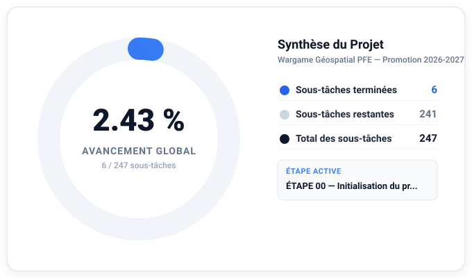

# ÉTAT D’AVANCEMENT DU PROJET

**Dernière mise à jour automatique :** 2026-09-18 00:09:34  
**Source de vérité :** [`docs/ROADMAP.md`](file:///c:/Users/salah/Desktop/WARGAME_GEOSPATIAL_PFE/docs/ROADMAP.md)  
**Outil de synchronisation :** `python scripts/update_progress.py`

---

## Progression globale

# **0,00 %**
### Avancement réel calculé sur les sous-tâches terminales

### Statistiques consolidées

| Indicateur | Valeur |
|---|---:|
| **Sous-tâches totales** | 247 |
| **Sous-tâches terminées** | 0 |
| **Sous-tâches restantes** | 247 |
| **Pourcentage global** | **0,00 %** |
| **Étapes terminées (PASS)** | 0 / 31 |
| **Étape active** | **ÉTAPE 00 — Initialisation du projet** |
| **Étapes restantes** | 31 |

---

## Étape active

**ÉTAPE 00 — Initialisation du projet**
- **Statut :** `PLANNED`
- **Progression de l'étape :** 0 / 8 sous-tâches (0.00 %)
- **Règle de l'étape active unique :** Cette étape doit être intégralement validée avec preuves avant tout engagement sur l'étape suivante.

---

## Dernières tâches terminées

*Aucune sous-tâche encore terminée.*

---

## Prochaines tâches

- [ ] `P00-T01-S01` — Configurer le dépôt distant GitHub avec la branche principale main *(ÉTAPE 00)*
- [ ] `P00-T01-S02` — Créer le fichier .gitignore interdisant les caches, binaires et données SIG volumineuses *(ÉTAPE 00)*
- [ ] `P00-T01-S03` — Définir le guide de gestion des branches par phase dans docs/GIT_WORKFLOW_AND_CICD.md *(ÉTAPE 00)*
- [ ] `P00-T01-S04` — Mettre en place la convention de commits sémantiques dans AGENT_RULES.md *(ÉTAPE 00)*
- [ ] `P00-T02-S01` — Créer l'arborescence des dossiers src, tests, data, docs, scripts et docker *(ÉTAPE 00)*

---

## Tâches bloquées

*Aucune tâche bloquée actuellement.*

---

## Avancement détaillé par étape

| Étape | Total | Terminées | Restantes | Avancement | Statut |
|:---|---:|---:|---:|---:|:---:|
| ÉTAPE 00 — Initialisation du projet | 8 | 0 | 8 | 0,00 % | `PLANNED` |
| ÉTAPE 01 — Analyse détaillée du cahier des charges | 7 | 0 | 7 | 0,00 % | `PLANNED` |
| ÉTAPE 02 — Architecture fonctionnelle et technique | 9 | 0 | 9 | 0,00 % | `PLANNED` |
| ÉTAPE 03 — Modèle de données | 7 | 0 | 7 | 0,00 % | `PLANNED` |
| ÉTAPE 04 — Préparation de l’environnement | 8 | 0 | 8 | 0,00 % | `PLANNED` |
| ÉTAPE 05 — Collecte SIG avec Global Mapper | 8 | 0 | 8 | 0,00 % | `PLANNED` |
| ÉTAPE 06 — Préparation et nettoyage SIG avec Global Mapper | 8 | 0 | 8 | 0,00 % | `PLANNED` |
| ÉTAPE 07 — Contrôle qualité SIG | 8 | 0 | 8 | 0,00 % | `PLANNED` |
| ÉTAPE 08 — Modèle du terrain | 8 | 0 | 8 | 0,00 % | `PLANNED` |
| ÉTAPE 09 — Conception de la grille hexagonale | 8 | 0 | 8 | 0,00 % | `PLANNED` |
| ÉTAPE 10 — Validation de la grille | 8 | 0 | 8 | 0,00 % | `PLANNED` |
| ÉTAPE 11 — Intégration PostgreSQL/PostGIS | 8 | 0 | 8 | 0,00 % | `PLANNED` |
| ÉTAPE 12 — Modèle des unités | 8 | 0 | 8 | 0,00 % | `PLANNED` |
| ÉTAPE 13 — Modèle des équipements | 8 | 0 | 8 | 0,00 % | `PLANNED` |
| ÉTAPE 14 — Modèle des capteurs | 8 | 0 | 8 | 0,00 % | `PLANNED` |
| ÉTAPE 15 — Moteur de simulation | 8 | 0 | 8 | 0,00 % | `PLANNED` |
| ÉTAPE 16 — Déplacements | 8 | 0 | 8 | 0,00 % | `PLANNED` |
| ÉTAPE 17 — Observations et incertitude | 8 | 0 | 8 | 0,00 % | `PLANNED` |
| ÉTAPE 18 — État réel / état perçu | 8 | 0 | 8 | 0,00 % | `PLANNED` |
| ÉTAPE 19 — Temps et événements | 8 | 0 | 8 | 0,00 % | `PLANNED` |
| ÉTAPE 20 — Modèle de décision | 8 | 0 | 8 | 0,00 % | `PLANNED` |
| ÉTAPE 21 — Services Drogon | 8 | 0 | 8 | 0,00 % | `PLANNED` |
| ÉTAPE 22 — Interface Blue | 8 | 0 | 8 | 0,00 % | `PLANNED` |
| ÉTAPE 23 — Interface Red | 8 | 0 | 8 | 0,00 % | `PLANNED` |
| ÉTAPE 24 — Interface Umpire | 8 | 0 | 8 | 0,00 % | `PLANNED` |
| ÉTAPE 25 — Journalisation | 8 | 0 | 8 | 0,00 % | `PLANNED` |
| ÉTAPE 26 — Rejeu | 8 | 0 | 8 | 0,00 % | `PLANNED` |
| ÉTAPE 27 — Débriefing et indicateurs | 8 | 0 | 8 | 0,00 % | `PLANNED` |
| ÉTAPE 28 — Scénario de démonstration complet | 8 | 0 | 8 | 0,00 % | `PLANNED` |
| ÉTAPE 29 — Validation globale | 8 | 0 | 8 | 0,00 % | `PLANNED` |
| ÉTAPE 30 — Documentation finale et soutenance | 8 | 0 | 8 | 0,00 % | `PLANNED` |

---

*Ce tableau de bord est généré automatiquement. Ne pas modifier manuellement. Pour mettre à jour l'avancement, cocher les cases dans `docs/ROADMAP.md` puis exécuter `python scripts/update_progress.py`.*
